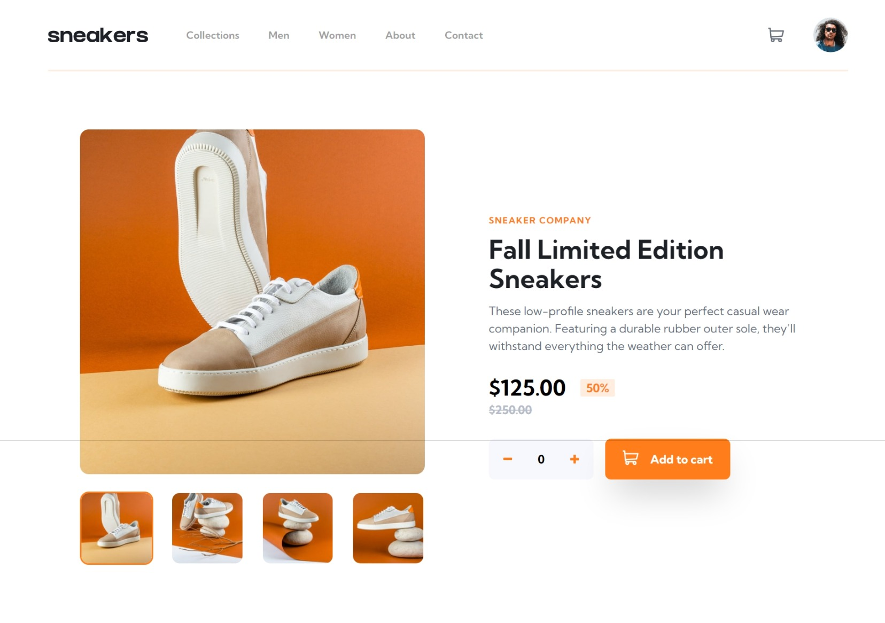
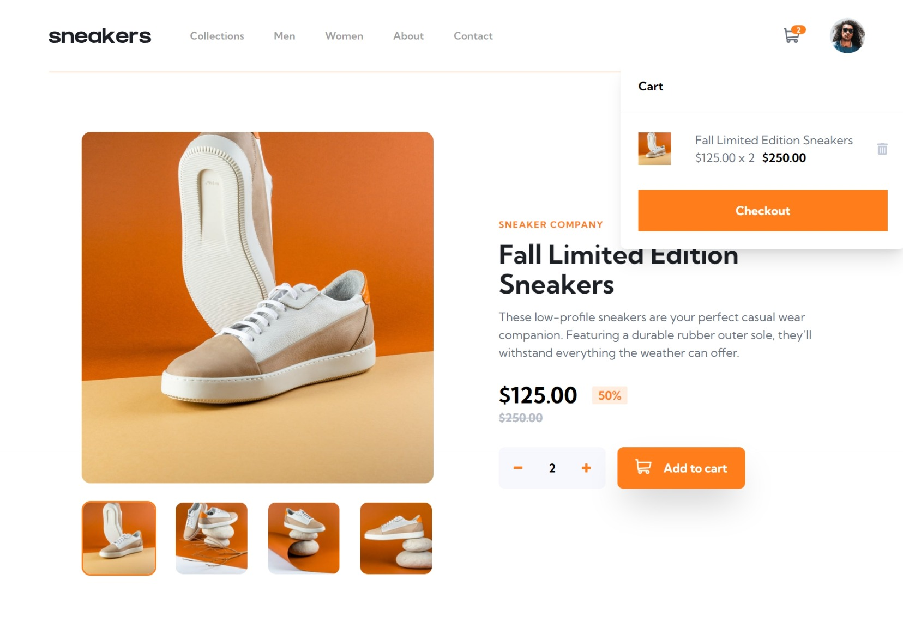
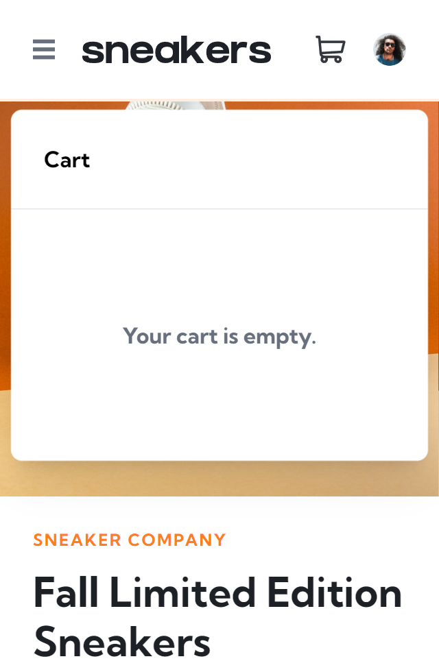

# Frontend Mentor - E-commerce product page solution

This is a solution to the [E-commerce product page challenge on Frontend Mentor](https://www.frontendmentor.io/challenges/ecommerce-product-page-UPsZ9MJp6). Frontend Mentor challenges help you improve your coding skills by building realistic projects.

## Table of contents

- [Overview](#overview)
  - [The challenge](#the-challenge)
  - [Screenshot](#screenshot)
  - [Links](#links)
- [My process](#my-process)
  - [Built with](#built-with)
  - [Continued development](#continued-development)
- [Author](#author)

## Overview

### The challenge

Users should be able to:

- View the optimal layout for the site depending on their device's screen size
- See hover states for all interactive elements on the page
- Open a lightbox gallery by clicking on the large product image
- Switch the large product image by clicking on the small thumbnail images
- Add items to the cart
- View the cart and remove items from it

### Screenshot

## Desktop

<!-- 

## Mobile

 -->

### Links

- Solution URL: [Add solution URL here](https://github.com/WolfMozart8/ecommerce-angular)
- Live Site URL: [Add live site URL here](https://WolfMozart8.github.io/ecommerce-angular)

## My process

### Built with

- [Angular](https://angular.io/) - JS framework
- [Tailwind](https://tailwindcss.com/) - CSS framework

### Continued development

I want to make a "complete" eccomerce page. It will fetch data from an api.

## Author

- Frontend Mentor - [@WolfMozart8](https://www.frontendmentor.io/profile/WolfMozart8)
- Github - [Wolfmozart8](https://github.com/WolfMozart8)
